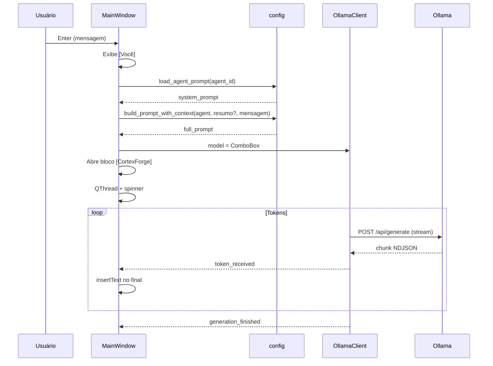

# Arquitetura do CortexForge

Visão da estrutura atual do projeto (v0.9) e do fluxo de dados.

## Estrutura de pastas

```
CortexForge/
├── app.py                 # Entrada da aplicação
├── requirements.txt
├── agents/                # Prompts de sistema (.txt)
├── core/                  # Lógica de negócio
│   ├── config.py
│   ├── ollama_client.py
│   ├── project_context.py
│   ├── project_scanner.py
│   └── project_summary.py
├── ui/
│   ├── main_window.py     # Interface principal
│   └── ollama_worker.py   # QThread para generate()
└── docs/                  # Documentação
```

## Módulos principais

### `app.py`

Ponto de entrada. Cria `QApplication`, instancia `MainWindow` e inicia o loop de eventos Qt.

### `ui/main_window.py`

Responsável por toda a interface:

| Área              | Componentes                                      |
|-------------------|--------------------------------------------------|
| Barra superior    | Modelo (ComboBox), Agente (ComboBox), Atualizar  |
| Painel esquerdo   | Projetos, botão Abrir Pasta, info da pasta       |
| Área central      | Chat (`QTextEdit`)                               |
| Inferior          | Campo de mensagem (`QLineEdit`)                  |

Orquestra chamadas a `OllamaClient`, `config` e `ProjectContext`. A geração de respostas é delegada a `OllamaGenerateWorker` (QThread) para não bloquear a UI. Barra de status inferior exibe o estado da operação.

### `ui/ollama_worker.py`

`QThread` que chama `generate(prompt, stream=True)` e emite:

- `token_received(str)` — cada fragmento da resposta
- `generation_finished()` — sucesso
- `generation_error(str)` — falha

A UI insere tokens no final do `QTextEdit` sem reconstruir o histórico.

### `core/ollama_client.py`

Cliente HTTP para o Ollama (`http://localhost:11434`):

- `is_available()` — verifica se o serviço responde
- `list_models()` — lista modelos instalados
- `generate(prompt, stream=False)` — resposta completa (tupla)
- `generate(prompt, stream=True)` — iterador de tokens (NDJSON da API)

Retorna tuplas `(dados, erro)` com mensagens amigáveis em português.

### `core/config.py`

Configuração central:

- `DEFAULT_AGENT` — agente selecionado ao iniciar (`coder`)
- `AGENT_FILES` / `AGENT_LABELS` — mapeamento agente → arquivo / rótulo UI
- `load_agent_prompt(agent_id)` — lê `agents/<nome>.txt`
- `load_agent_prompt()` — lê perfis em `agents/`
- `build_prompt()` — legado agente + mensagem (substituído na UI por `build_prompt_with_context`)

### `agents/*.txt`

Arquivos de texto com o **prompt de sistema** de cada perfil. Editáveis sem alterar código Python.

### `core/project_context.py`

Representa a pasta de projeto selecionada:

- `name` — nome da pasta (último segmento do caminho)
- `path` — caminho absoluto

Na v0.5 armazena nome e caminho. Na v0.7+ o painel exibe estatísticas e resumo; na v0.8 o resumo entra no prompt enviado ao Ollama.

### `core/project_scanner.py`

`ProjectScanner` percorre a árvore de diretórios (sem abrir conteúdo) e retorna `ProjectScanResult`:

- totais de pastas e arquivos
- contagens por extensão (`.py`, `.md`, `.txt`)
- existência de `README.md`, `requirements.txt`, `pyproject.toml` na raiz
- tamanho total em bytes

Ignora pastas comuns como `.git` e `__pycache__`. Execução síncrona na thread da UI ao abrir pasta.

### `core/project_summary.py`

`ProjectSummaryBuilder` transforma `ProjectScanResult` em texto (nome, caminho, contagens, flags, tamanho). O resumo fica em memória na `MainWindow` (`_project_summary`). `build_prompt_with_context()` monta:

```
<prompt do agente>

CONTEXTO DO PROJETO
<resumo>

PERGUNTA DO USUÁRIO
<mensagem>
```

Se não houver projeto aberto, apenas o prompt do agente e a pergunta são enviados (formato anterior).

## Fluxo atual do prompt



**Observações:**

- O chat exibe apenas a mensagem do usuário, não o system prompt completo.
- Não há histórico de conversa: cada envio é independente.
- Streaming ativo (v0.9): tokens exibidos progressivamente no chat.
- A requisição roda em thread separada; spinner na barra de status (100 ms).
- Com projeto aberto, o resumo do scanner entra no prompt; conteúdo dos arquivos **não** é lido.

## Dependências

| Pacote   | Uso                    |
|----------|------------------------|
| PySide6  | Interface desktop      |
| requests | Cliente HTTP Ollama    |

## Evolução prevista

Versões futuras introduzirão scanner de projeto, injeção de contexto no prompt e processamento assíncrono, sem alterar o papel básico dos módulos acima. Ver [ROADMAP.md](ROADMAP.md).
