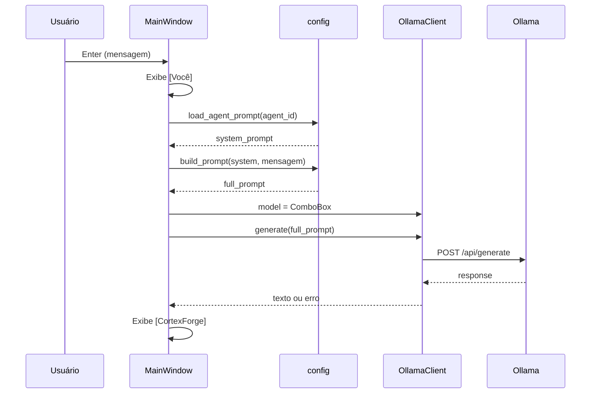

# Arquitetura do CortexForge

Visão da estrutura atual do projeto (v0.5) e do fluxo de dados.

## Estrutura de pastas

```
CortexForge/
├── app.py                 # Entrada da aplicação
├── requirements.txt
├── agents/                # Prompts de sistema (.txt)
├── core/                  # Lógica de negócio
│   ├── config.py
│   ├── ollama_client.py
│   └── project_context.py
├── ui/
│   └── main_window.py     # Interface principal
└── docs/                  # Documentação
```

## Módulos principais

### `app.py`

Ponto de entrada. Cria `QApplication`, instancia `MainWindow` e inicia o loop de eventos Qt.

### `ui/main_window.py`

Responsável por toda a interface:

| Área              | Componentes                                      |
|-------------------|--------------------------------------------------|
| Barra superior    | Modelo (ComboBox), Agente (ComboBox), Atualizar  |
| Painel esquerdo   | Projetos, botão Abrir Pasta, info da pasta       |
| Área central      | Chat (`QTextEdit`)                               |
| Inferior          | Campo de mensagem (`QLineEdit`)                  |

Orquestra chamadas a `OllamaClient`, `config` e `ProjectContext`. Não contém lógica HTTP direta.

### `core/ollama_client.py`

Cliente HTTP para o Ollama (`http://localhost:11434`):

- `is_available()` — verifica se o serviço responde
- `list_models()` — lista modelos instalados
- `generate(prompt)` — envia prompt ao modelo definido em `client.model`

Retorna tuplas `(dados, erro)` com mensagens amigáveis em português.

### `core/config.py`

Configuração central:

- `DEFAULT_AGENT` — agente selecionado ao iniciar (`coder`)
- `AGENT_FILES` / `AGENT_LABELS` — mapeamento agente → arquivo / rótulo UI
- `load_agent_prompt(agent_id)` — lê `agents/<nome>.txt`
- `build_prompt(system, user)` — concatena prompt do agente + mensagem

### `agents/*.txt`

Arquivos de texto com o **prompt de sistema** de cada perfil. Editáveis sem alterar código Python.

### `core/project_context.py`

Representa a pasta de projeto selecionada:

- `name` — nome da pasta (último segmento do caminho)
- `path` — caminho absoluto

Na v0.5 apenas armazena e exibe; não escaneia arquivos nem envia contexto ao Ollama.

## Fluxo atual do prompt



**Observações:**

- O chat exibe apenas a mensagem do usuário, não o system prompt completo.
- Não há histórico de conversa: cada envio é independente.
- Não há streaming: resposta única após conclusão da requisição.
- O contexto de pasta (v0.5) ainda **não** entra no prompt.

## Dependências

| Pacote   | Uso                    |
|----------|------------------------|
| PySide6  | Interface desktop      |
| requests | Cliente HTTP Ollama    |

## Evolução prevista

Versões futuras introduzirão scanner de projeto, injeção de contexto no prompt e processamento assíncrono, sem alterar o papel básico dos módulos acima. Ver [ROADMAP.md](ROADMAP.md).
