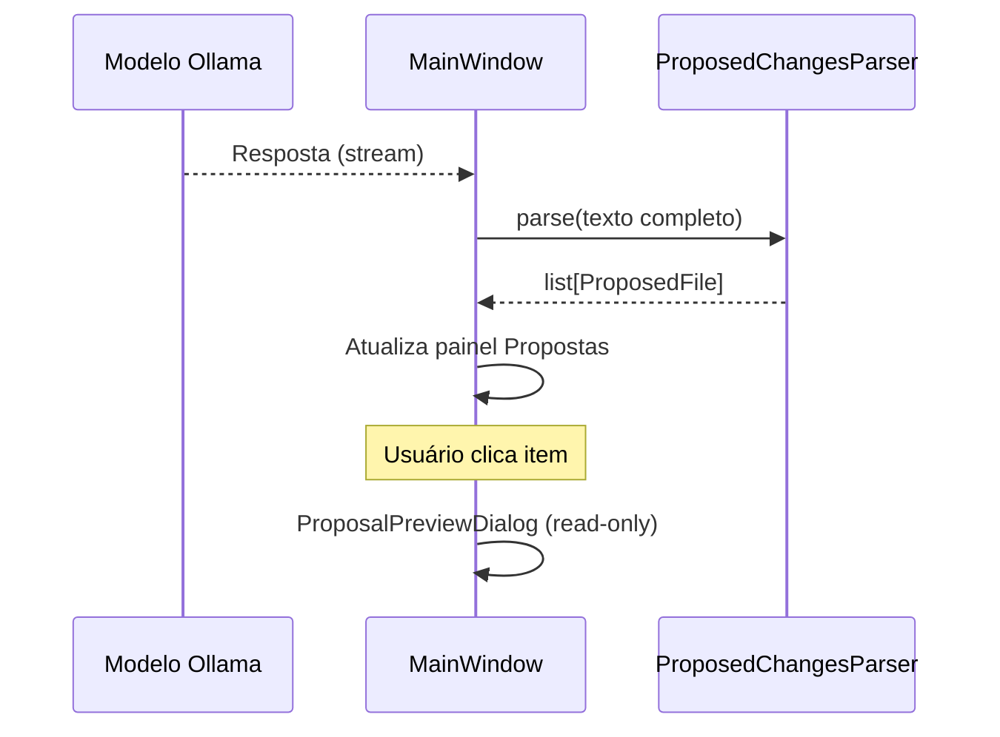

# Propostas de arquivos (v1.0)

Fluxo inspirado em IDEs assistidas por IA: o modelo **sugere** alterações; o usuário **revisa** antes de qualquer mudança no disco.

## O que faz

1. Após uma resposta do Ollama, o CortexForge procura marcadores no texto.
2. Extrai nome/caminho e conteúdo proposto.
3. Mantém tudo **em memória** na lista **Propostas**.
4. Ao clicar em um item, abre janela **somente leitura** com botão **Copiar Conteúdo**.

## O que não faz (v1.0)

- Não cria arquivos automaticamente
- Não modifica arquivos no projeto
- Não apaga arquivos
- Não aplica diff
- Não integra Git

## Formatos reconhecidos

O modelo deve usar um destes cabeçalhos:

```text
# FILE: caminho/arquivo.py
```

ou

```text
Arquivo: caminho/arquivo.py
```

O conteúdo do arquivo é o texto **após** a linha do marcador, até o próximo marcador ou o fim da resposta. Cercas markdown ` ``` ` são removidas automaticamente.

### Exemplo

```text
Segue o código:

# FILE: jogo_forca.py

def jogar():
    print("forca")
```

## Tipos de ação

| Valor | Significado |
|-------|-------------|
| `CREATE_FILE` | Arquivo não existe na pasta do projeto aberto |
| `MODIFY_FILE` | Arquivo já existe no caminho relativo indicado |

Sem projeto aberto, todas as propostas são tratadas como `CREATE_FILE`.

## Módulos

| Arquivo | Papel |
|---------|--------|
| `core/proposed_changes.py` | `ProposedFile`, `FileActionType`, `ProposedChangesParser` |
| `ui/proposal_preview_dialog.py` | Diálogo de visualização e cópia |
| `ui/main_window.py` | Painel **Propostas** e integração ao fim do streaming |

## Fluxo



## Próximas versões (planejado)

- Diff visual
- Botão aplicar / rejeitar proposta
- Confirmação antes de gravar em disco
